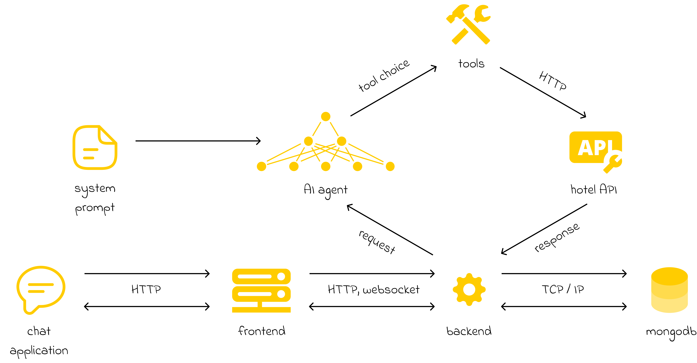

# Backend

## Description

A backend service for handling AI-driven hotel interactions using Flask, MongoDB, and OpenAI models.



## 🚀 Run Application

1. **Clone the repository:**
   ```bash
   git clone https://github.com/24h-du-code-2025/back-end.git <directory>
   ```

2. **Navigate to the repository directory:**
   ```bash
   cd <directory>
   ```

3. **Create and activate a virtual environment:**
   ```bash
   python3 -m venv venv
   source venv/bin/activate
   ```

4. **Install dependencies:**
   ```bash
   pip install -r requirements.txt
   ```

5. **Create a `.env` file** using the `.env.dist` template and fill it with environment variables:
   ```ini
   ATLAS_URI=mongodb://127.0.0.1/?retryWrites=true&w=majority
   DB_NAME=hotel-california
   LLM_MODEL=CHATGPT
   HOTEL_API_URL=https://app-584240518682.europe-west9.run.app/
   HOTEL_API_KEY=
   OPEN_WEATHER_API_KEY=
   OPENAI_API_KEY=
   LANGSMITH_TRACING=true
   LANGSMITH_ENDPOINT="https://api.smith.langchain.com"
   LANGSMITH_API_KEY=
   LANGSMITH_PROJECT="hackaton"
   ```

6. **Launch the server:**
   ```bash
   flask --app server run --debug
   ```

   **🔹 Note:** Ensure you have a **MongoDB instance running** on port **27017** before starting the application.

---

## 📁 Project Structure  

| Folder / File | Description |
|--------------|------------|
| [`assets/`](assets) | Application diagrams |
| [`model/`](model) | Model classes for interacting with the hotel REST API |
| [`prompts/`](prompts) | Prompt templates sent to the LLM |
| [`tools/`](tools) | Function tools used by the AI agent |
| [`utils/`](utils) | Utility functions |
| [`config.py`](config.py) | Configuration class storing environment variables |
| [`server.py`](server.py) | Main Flask application |

---

## ⚙️ Technical Stack  

- **🐍 Python** – Core programming language
- **🌶️ Flask** – Web framework
- **🍃 PyMongo** – MongoDB integration
- **🔗 LangChain** – LLM orchestration
- **🕸️ LangGraph** – LLM graph-based reasoning + creation of AI agents
- **📂 LangSmith** – LLM debugging & tracing
- **🤖 OpenAI** – AI model integration
- **🗣️ Whisper** – Speech-to-text processing
